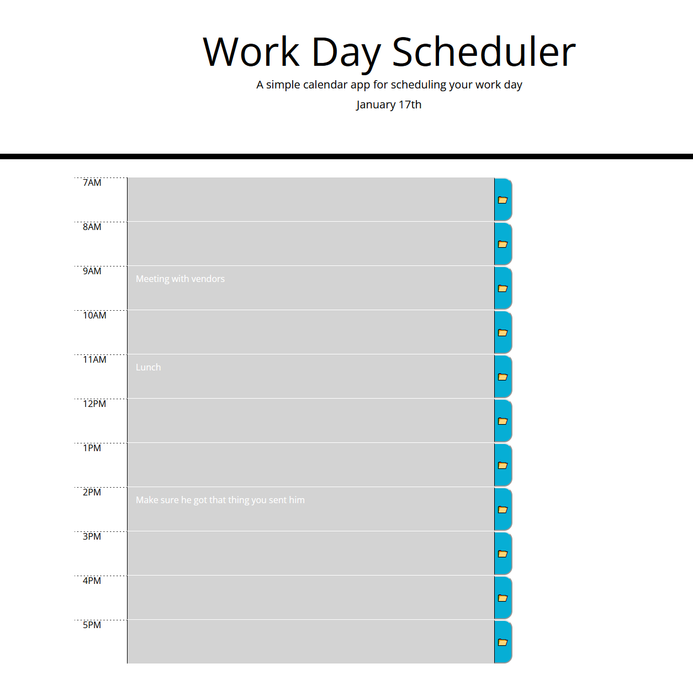

# 05 Third-Party APIs: Work Day Scheduler

This is a daily planner that will save events you wish to keep, and display the save events on page refresh.

This page keeps track of what time of day it is using moment.js, and changes the background of the hour to show if it is in the past, current, or future.

Link to html: https://seyaryu.github.io/1-18_Homework/
